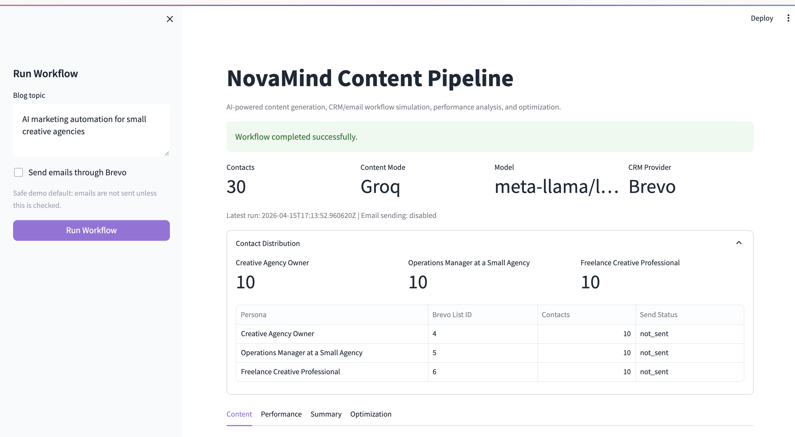
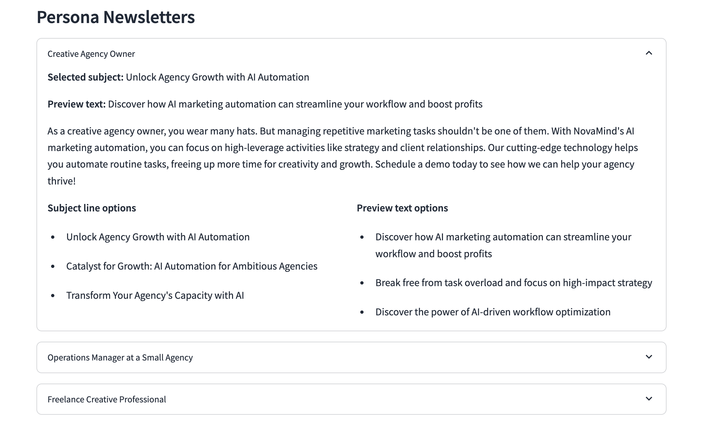
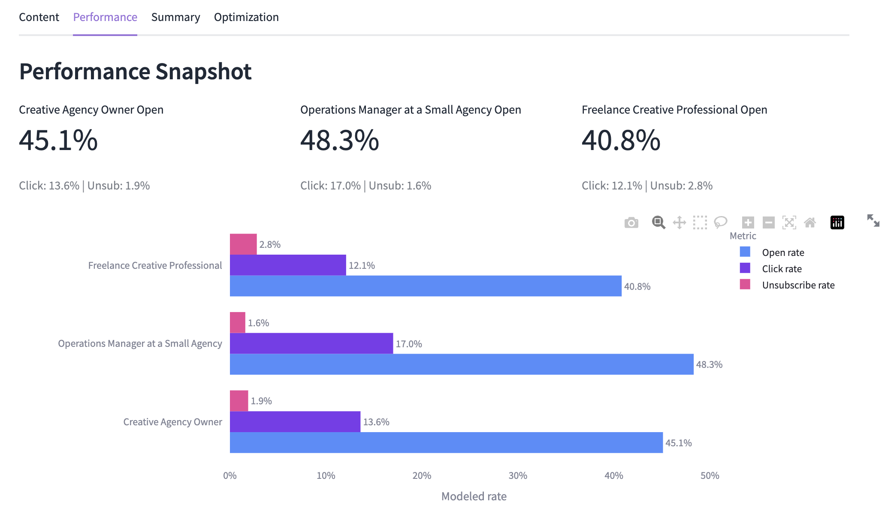
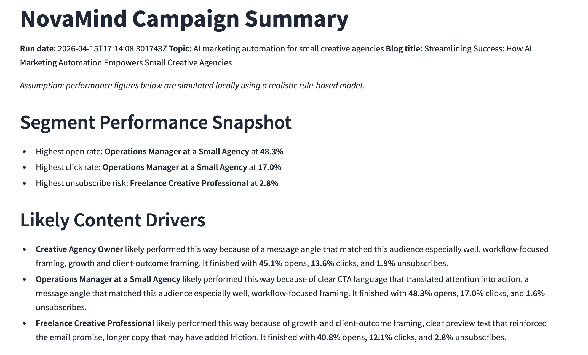
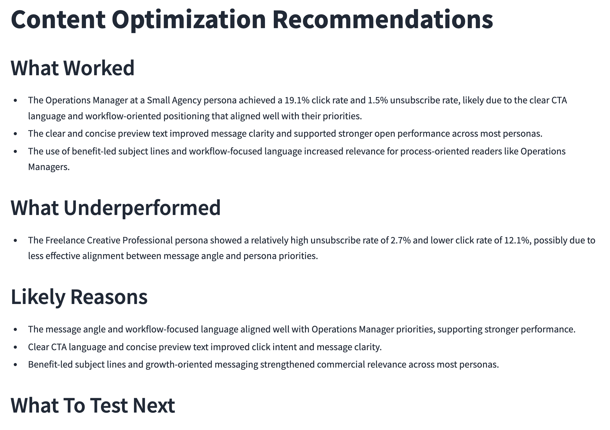

# NovaMind Content Pipeline

## Overview

**NovaMind Content Pipeline** is a lightweight AI-powered marketing workflow built for small creative agencies. It turns a single campaign topic into multi-format content, syncs audience contacts into a CRM, delivers persona-specific newsletters, analyzes campaign performance, and recommends what to test next. The pipeline is designed as an end-to-end loop from content generation to distribution, measurement, and optimization.

The implementation is intentionally lightweight:

- local Python CLI
- Streamlit dashboard
- Groq for content generation
- Brevo for CRM and email delivery
- local JSON files for logs and generated artifacts
- rule-based performance simulation and AI-style optimization recommendations

## End-to-End Workflow

For a single topic input, the app:

1. Generates multiple blog title options, outline options, and persona-specific newsletter copy options using Groq
2. Loads local sample contacts from `data/contacts.json`
3. Creates or updates those contacts in Brevo
4. Maps each contact into the correct persona-based Brevo list
5. Selects one final send version for each persona and sends it through Brevo transactional email
6. Logs campaign metadata locally in `data/campaign_logs.json`
7. Simulates performance metrics using a realistic rule-based model and stores them in `data/performance_history.json`
8. Writes a markdown campaign summary to `outputs/latest_run_summary.md`
9. Generates content optimization recommendations in `outputs/content_optimization_recommendations.md`

## Key Capabilities

- **Multiple copy options:** The content layer generates three blog title options, two outline options, two newsletter subject lines, two preview texts, and two body/copy angles per persona.
- **Selected send version:** The stored content keeps both the raw options and the selected final title, outline, subject line, preview text, and body used for sending.
- **Persona-specific newsletters:** Newsletter copy is tailored for Creative Agency Owners, Operations Managers at small agencies, and Freelance Creative Professionals.
- **AI-driven optimization:** The optimizer reviews the latest generated content, performance history, and campaign summary to recommend next blog topics, stronger subject lines, persona-specific revisions, and the next test plan.

## Architecture Overview

The app is organized as a simple pipeline. `main.py` coordinates the CLI workflow, while `app.py` provides a lightweight Streamlit dashboard. Both use the same service modules for content generation, Brevo CRM/email execution, campaign logging, performance simulation, performance analysis, and content optimization. `data/` and `outputs/` make the run history easy to inspect without adding a database.

## Tech Stack

- **Python 3**
- **Groq API** for LLM content generation
- **OpenAI Python SDK** as the OpenAI-compatible client for Groq
- **Brevo API** for CRM contact sync and transactional email sending
- **requests** for Brevo API calls
- **python-dotenv** for local environment loading
- **Streamlit** for the local dashboard

## Project Structure

```text
novamind-content-pipeline/
├── README.md
├── requirements.txt
├── .env.example
├── app.py
├── main.py
├── config.py
├── prompts/
│   ├── __init__.py
│   ├── content_prompts.py
│   └── optimization_prompts.py
├── services/
│   ├── __init__.py
│   ├── campaign_logger.py
│   ├── content_generator.py
│   ├── content_optimizer.py
│   ├── crm_service.py
│   ├── metrics_simulator.py
│   ├── performance_analyzer.py
│   └── workflow_runner.py
├── data/
│   ├── contacts.json
│   ├── segment_definitions.json
│   ├── generated_content.json
│   ├── campaign_logs.json
│   └── performance_history.json
└── outputs/
    ├── latest_run_summary.md
    └── content_optimization_recommendations.md
```

## Setup

### 1. Create and activate a virtual environment

```bash
python3 -m venv .venv
source .venv/bin/activate
```

### 2. Install dependencies

```bash
pip install -r requirements.txt
```

### 3. Create a local `.env` file

```bash
cp .env.example .env
```

Use this format:

```env
GROQ_API_KEY=your_groq_api_key_here
GROQ_MODEL=openai/gpt-oss-20b

BREVO_API_KEY=your_brevo_api_key_here
BREVO_SENDER_EMAIL=your_sender_email_here
BREVO_SENDER_NAME=NovaMind
BREVO_LIST_ID_OWNER=123
BREVO_LIST_ID_OPERATIONS=456
BREVO_LIST_ID_FREELANCE=789
```

Notes:

- If `GROQ_API_KEY` is blank, the app falls back to a deterministic local content generator.
- Brevo credentials are required for real CRM sync and transactional email sending.
- No secrets are hardcoded in the repository.

## Run Locally

### CLI

Run with a topic directly:

```bash
python3 main.py --topic "AI automation for small creative agencies"
```

Or run interactively:

```bash
python3 main.py
```

### Streamlit Dashboard

Run the dashboard:

```bash
streamlit run app.py
```

The dashboard lets you enter a topic, run the workflow, view generated content, inspect persona newsletters, compare simulated performance, and read the latest optimization recommendations. The **Send emails through Brevo** checkbox is off by default for safe demo runs.



## Outputs

After a successful run:

- `data/generated_content.json` stores blog and newsletter options plus the selected final send versions
- `data/campaign_logs.json` stores campaign metadata and Brevo send details
- `data/performance_history.json` stores realistic rule-based simulated delivery, open, click, and unsubscribe metrics
- `outputs/latest_run_summary.md` stores the latest markdown performance summary
- `outputs/content_optimization_recommendations.md` stores recommended next topics, improved subject line ideas, persona-specific revisions, and an optimization memo



## Performance Simulation

This MVP uses a realistic rule-based simulation for engagement metrics rather than a fixed mock. The simulator starts with persona-level baselines, then adjusts outcomes using lightweight content signals such as subject-line style, preview-text clarity, CTA presence, content length, and whether the copy emphasizes workflow efficiency or growth outcomes.

This approach was chosen to keep the project submission-ready while still producing performance logs that are more believable and easier to discuss than random or flat deterministic values. In a production version, the same reporting layer could be updated to ingest real Brevo delivery, open, click, and unsubscribe events instead of simulated records.




## Content Optimization

After the campaign summary is generated, the optimizer uses the latest generated content, performance records, and markdown summary to produce a short content-growth memo. The recommendations focus on what to test next: topic direction, headline/subject-line improvements, CTA patterns to reuse, and persona segments that need sharper value propositions.



## Assumptions and Demo Notes

- This project is designed as a small demo, not a production system.
- Sample and test contacts were used for safe CRM and email workflow validation.
- The Streamlit dashboard defaults to not sending emails; users must explicitly enable Brevo sends from the sidebar.
- Performance metrics are simulated locally so the pipeline always produces a summary, even though CRM sync and email sending use Brevo.
- The content optimizer uses the latest local artifacts and falls back to deterministic recommendations if a Groq API key is not available.
- Multiple copy options are generated to demonstrate realistic content workflow thinking, but the final send selection is intentionally simple for MVP clarity.
- The structure is intentionally simple so the end-to-end flow is easy to review in a take-home setting.
